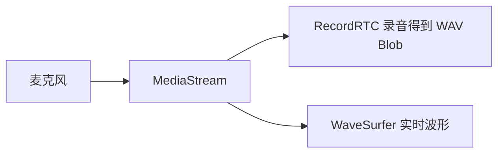

# useAudioRecorder 分步学习

源码位置：`src/features/voices/hooks/use-audio-recorder.ts`

---

## 第 0 步：这个 Hook 在解决什么问题？

你要在网页里「录音」，并且希望用户能看到 **实时波形**。浏览器只提供底层能力：

- `navigator.mediaDevices.getUserMedia`：向用户要麦克风，拿到一条 **`MediaStream`**（像一根管子，里面是连续的音频数据）。

本 Hook 做两件事：

1. **把流录成文件**：用 **RecordRTC**，得到 **`Blob`（WAV）**，方便上传或播放。
2. **把流画成波形**：用 **WaveSurfer.js + Record 插件**，把 **同一条流** 接到画布上。

所以逻辑上可以画成：



---

## 第 1 步：先分清「界面状态」和「不触发重绘的东西」

| 类型 | 放什么 | 为什么 |
|------|--------|--------|
| `useState` | `isRecording`、`elapsedTime`、`audioBlob`、`error` | 变了要更新界面（按钮文案、计时、预览、错误提示） |
| `useRef` | `recorderRef`、`streamRef`、`timerRef`、`wsRef`、`micStreamRef`、`containerRef` | 保存 **对象实例** 或 **DOM**，变了 **不想** 让整个组件重渲染 |

**记忆点**：`containerRef` 给使用方绑定在 **装波形的 div** 上；WaveSurfer 需要真实 DOM 节点才能 `create`。

---

## 第 2 步：为什么要 `destroyWaveSurfer` 和 `cleanup` 两层？

录音涉及 **浏览器资源**，不释放会：

- 麦克风灯一直亮、占用设备；
- `setInterval` 继续跑；
- WaveSurfer / 插件占着画布和内部监听。

**`destroyWaveSurfer`** 只负责波形侧：

1. 先调 `renderMicStream` 返回句柄的 **`onDestroy()`**（插件要求的清理顺序）。
2. 再 **`ws.destroy()`** 销毁 WaveSurfer 实例。

**`cleanup`** 负责整条链路：

1. 清 **计时器**；
2. 销毁 **RecordRTC**；
3. **停止** `MediaStream` 上所有 **track**（真正释放麦克风）；
4. 最后调用 **`destroyWaveSurfer`**。

**记忆点**：先停业务对象（录音器、计时），再停轨道，再拆 UI 插件——避免一边还在读流、一边已经拆了画布。

---

## 第 3 步：`useEffect` 为什么在 `isRecording === true` 时才建波形？

代码里有三个条件：

```ts
if (!isRecording || !containerRef.current || !streamRef.current) return;
```

含义分别是：

1. **`isRecording`**：只有进入「正在录音」状态，你的表单才会渲染 **带 `ref` 的波形容器**；若过早创建，容器可能是 `null`。
2. **`containerRef.current`**：WaveSurfer 必须挂到一个 **已挂载的 DOM** 上。
3. **`streamRef.current`**：`startRecording` 里先 `getUserMedia` 再 `setIsRecording(true)`，所以 effect 跑的时候流应该已经存进 ref 了。

effect 的 **清理函数**里会 `destroyWaveSurfer()`：当 `isRecording` 变 false 或组件卸载时，拆掉波形，避免重复创建泄漏。

---

## 第 4 步：`startRecording` 的执行顺序（跟着读一遍）

建议你在 IDE 里打开函数，从下往上对下面序号：

1. 清空 `error`、`audioBlob`，`elapsedTime` 归零。
2. **`getUserMedia({ audio: true })`** → 得到 `stream`，存入 **`streamRef`**。
3. **动态 `import('recordrtc')`**：延迟加载，打包时可单独拆 chunk。
4. `new RecordRTC(stream, { … })`，配置 **WAV、单声道、44100Hz**。
5. **`recorder.startRecording()`**，然后 **`setIsRecording(true)`** → 触发第 3 步里的 `useEffect` 去画波形。
6. **`setInterval` 每 100ms** 更新 `elapsedTime`（秒）。

若任一步失败：调用 **`cleanup()`**，并根据是否是 **`NotAllowedError`** 设置不同的 **`error`** 文案（用户拒绝麦克风 vs 其它设备问题）。

---

## 第 5 步：`stopRecording` 里为什么是异步回调？

`recorder.stopRecording(() => { ... })`：**停止编码并把内存里的数据封成 Blob** 需要一点时间，所以完成逻辑写在回调里：

1. `getBlob()` → `setAudioBlob`；
2. `setIsRecording(false)`；
3. **`cleanup()`** 释放麦克风和波形；
4. 若有 `onBlob`，把 **`Blob` 交给父组件**（例如立刻上传）。

若没有正在进行的 `recorder`，函数直接 `return`，避免空指针。

---

## 第 6 步：`resetRecording` 和 `stopRecording` 有什么不同？

| | `stopRecording` | `resetRecording` |
|---|----------------|------------------|
| 场景 | 正常结束一次录音，需要 **Blob** | 取消、重录、清空，**不一定**走完 RecordRTC 的 stop 回调 |
| 做法 | 走 `stopRecording` 回调链 | 直接 **`cleanup()`** + 重置所有 state |

**记忆点**：`reset` 是「不管录到哪了，一律拆掉并清空 UI 状态」。

---

## 第 7 步：在组件里怎么用这个 Hook？

1. 从 Hook 取出 **`containerRef`**，绑到 **波形区域的 div**（例如 `ref={containerRef}`）。
2. 开始按钮调 **`startRecording`****。
3. 结束调 **`stopRecording`**，需要的话传入 **`onBlob`**。
4. 展示 **`isRecording`、`elapsedTime`、`audioBlob`、`error`**。

---

## 自检小问题

1. 为什么波形用 **`streamRef`** 而不是再 `getUserMedia` 一次？（同一设备开两次流可能冲突或体验差。）
2. 为什么 `elapsedTime` 用 **`setInterval`** 而不是 `requestAnimationFrame`？（这里只需要大约 0.1s 更新一次的计时，不必跟显示器刷新率同步。）

---

## 延伸阅读（官方概念）

- [MDN：MediaStream](https://developer.mozilla.org/zh-CN/docs/Web/API/MediaStream)
- [MDN：getUserMedia](https://developer.mozilla.org/zh-CN/docs/Web/API/MediaDevices/getUserMedia)
